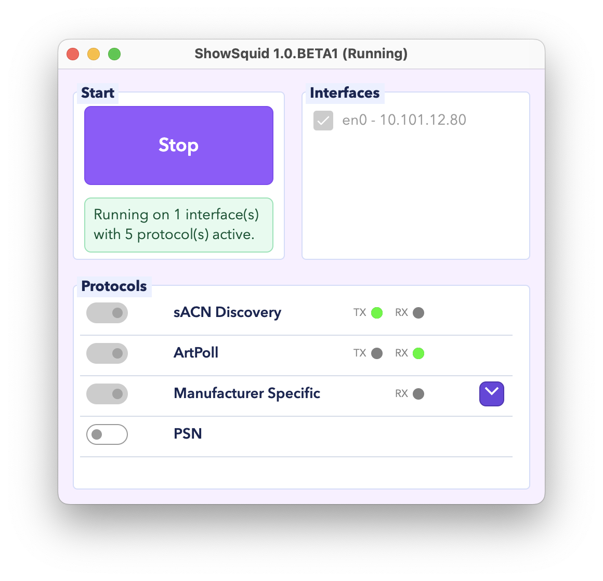

# ShowShark

Welcome to **ShowShark**, the advanced Wireshark post-dissector designed for entertainment networking analysis.  
ShowShark provides intelligent insights into lighting, media, and show control protocols such as **sACN**, **Art-Net**, **RDMnet**, and **OSC** — all in a familiar Wireshark environment.

---

## Overview

ShowShark extends Wireshark’s native protocol support to decode and enrich traffic from entertainment lighting systems. It identifies devices, manufacturers, universes, priorities, and more — with friendly names, detailed info columns, and session-wide host tracking.

### Key Features

- 🧠 **Smart Host Detection** – Tracks devices by MAC, IP, hostname, and manufacturer.
- 💡 **Protocol Insights** – Full support for sACN, Art-Net, RDMnet, and OSC.
- 🧩 **Device Identity Cache** – Persistent detection of known manufacturers and host types.
- 🌐 **Entertainment Multicast Awareness** – Recognises lighting and show-control traffic automatically.
- 📊 **Diagnostics Mode** – Displays IGMP queriers, multicast join behaviour, and timing data.
- ⚙️ **Customisable Output** – Enable or disable debug modes and select your own column formatting.

### ShowSquid Companion App

**ShowSquid** is a desktop companion app that prompts devices to communicate so ShowShark has more traffic to analyse. Select one or more network interfaces, enable the required protocol groups, and start a session to monitor live TX and RX activity for sACN, Art-Net, manufacturer-specific multicast, PSN, and other supported protocols.

<p align="center">
  
</p>

See the [ShowSquid documentation](https://showshark.net/docs/showsquid/) for setup instructions, protocol options, and Advanced mode.

---

## Installation

ShowShark works as a Lua post-dissector plugin for Wireshark.

### Requirements

- Wireshark 4.0 or later (with Lua 5.2+)
- macOS, Windows, or Linux
- Optional: debug console or logging enabled

### Installation Steps

1. Locate your Wireshark plugins directory:  
   - macOS: `~/.local/lib/wireshark/plugins/`
   - Windows: `%APPDATA%\Wireshark\plugins`
   - Linux: `~/.local/lib/wireshark/plugins/`

2. Copy the following files into your plugins directory:
   - `entnet.lua`
   - `entnet_hosts.lua`
   - `entnet_manufacturers.lua`
   - Any additional support modules (e.g., `TreeQueue.lua`, `helpers.lua`)

3. Restart Wireshark — you should see **ShowShark (Entertainment Networks)** listed in the Lua plugin log.

---

## Configuration

All configuration happens directly within the Lua files.  
Variables such as debug flags, manufacturer lookups, and field visibility can be edited near the top of each script.

### Example Options

```lua
local DEBUG = false
local ADD_DEBUG_PROTOCOL_FIELDS = true
local CACHE_TTL_SECONDS = 120
```

---

## Supported Protocols

| Protocol | Description | Notes |
|-----------|--------------|-------|
| **sACN** | Streaming ACN lighting control (E1.31) | Universe + Priority decoding |
| **Art-Net** | Classic DMX-over-IP | Full ArtPoll/ArtDMX decoding |
| **RDMnet** | Remote Device Management over TCP | Source/Responder discovery |
| **OSC** | Open Sound Control | Recognises `/eos/` and common controller strings |
| **IGMP** | Multicast management | Detects queriers, joins, leaves |

---

## Developer Notes

ShowShark was built to help technicians and engineers understand how entertainment networks behave in real-world environments.  
The dissector is written in **Lua**, taking advantage of Wireshark’s post-dissector API to dynamically enhance capture data.

### Design Philosophy

- **Human-first diagnostics**: prioritise clarity over raw data.
- **Cross-protocol correlation**: detect patterns that span multiple standards.
- **Low overhead**: lightweight, no external dependencies.
- **Friendly column names**: “ETC (10.101.10.50)” instead of “10.101.10.50”.

---

## Roadmap

- ✅ Basic sACN / Art-Net / RDMnet / OSC support
- ✅ Host identity caching and manufacturer lookups
- 🔄 Expand diagnostics tree for IGMP querier analysis
- 🔄 Add UI preferences for toggling debug columns
- 🧪 Investigate lightweight database for persistent host info
- 🚀 Add graphical visualisation or timeline export tools

---

## Troubleshooting

### Common Issues

| Problem | Solution |
|----------|-----------|
| Plugin not appearing | Ensure Lua is enabled in Wireshark (`About > Folders > Personal Plugins`). |
| Missing manufacturer | Verify `entnet_manufacturers.lua` exists and loads correctly. |
| Display names incorrect | Restart Wireshark to clear cache. |
| Error logs in console | Enable `DEBUG = true` and check the Lua log for line numbers. |

---

## Credits

Created by **Seb Barresi** at the **National Theatre**.  
Special thanks to the entertainment network engineering community for decades of collaboration and inspiration.

---

## License

ShowShark is released under the **MIT License**.  
Use it freely for diagnostics, training, and fun — attribution appreciated!
